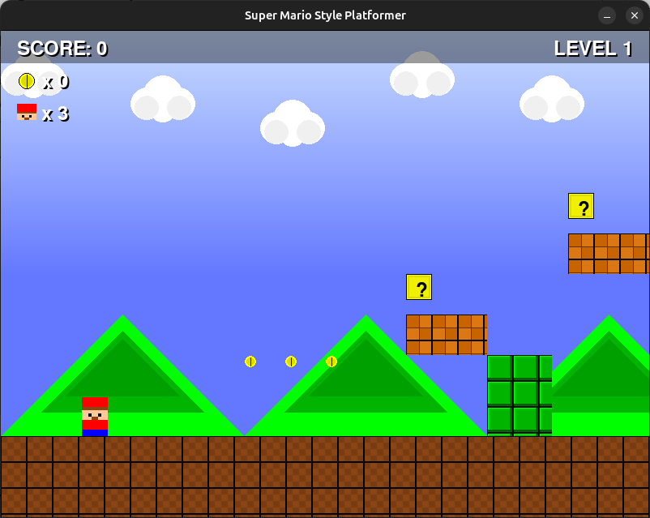
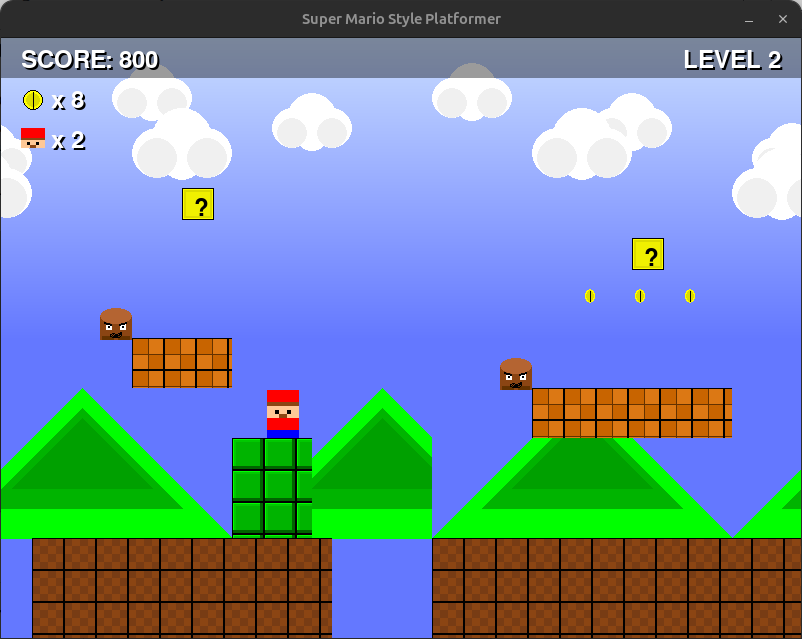
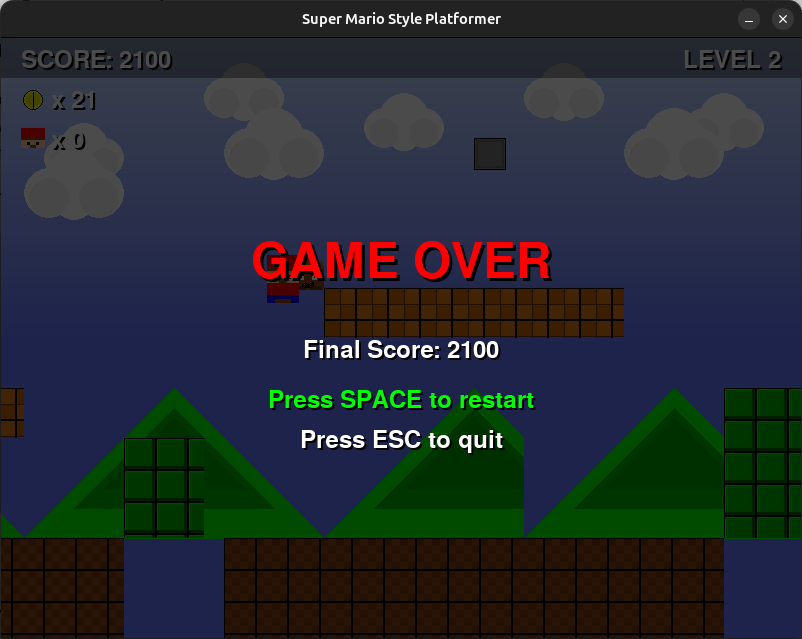

# Super Mario Style Platformer

A 2D side-scrolling platformer game inspired by Super Mario Bros, built with PyGame.



## Screenshots

<div align="center">
  
  
  <br/>
  
  
</div>

## Features

- **Classic Platformer Gameplay**: Run, jump, and bounce on enemies in true Mario style
- **Multiple Enemy Types**: Goombas and Koopas with unique behaviors and animations
- **Interactive Elements**: Coins to collect and question blocks to hit from below
- **Progressive Difficulty**: Three levels with increasing challenges
- **Complete Game Loop**: Lives system, score tracking, and game over screen with restart option
- **Pixel Art Graphics**: Custom sprites for all game elements
- **Sound Effects**: Jump sounds, coin collection, and death effects
- **Background Music**: Classic platformer-style soundtrack

## Controls

- **Left/Right Arrow Keys**: Move Mario left/right
- **Space**: Jump (and restart the game when on the game over screen)
- **ESC**: Quit game

## Installation

1. Make sure you have Python installed (Python 3.x recommended)
2. Install PyGame:
   ```
   pip install pygame
   ```
3. Clone this repository:
   ```
   git clone https://github.com/yourusername/mario-platformer.git
   cd mario-platformer
   ```
4. Run the game:
   ```
   python main.py
   ```

## Project Structure

```
mario_platformer/
├── main.py                  # Entry point for the game
├── assets/                  # Game assets folder
│   ├── images/              # Sprites and images
│   └── sounds/              # Sound effects and music
├── levels/                  # Level data files
├── screenshots/             # Game screenshots for documentation
└── src/                     # Source code
    ├── core/                # Core game functionality
    │   ├── main.py          # Main game loop and state management
    │   └── level_manager.py # Level loading and progression
    ├── entities/            # Game entities
    │   ├── player.py        # Player character class
    │   ├── enemy.py         # Enemy classes
    │   ├── platform_tile.py # Platform class
    │   ├── coin.py          # Coin class
    │   └── question_block.py # Question block class
    ├── ui/                  # User interface
    │   └── game_ui.py       # UI rendering
    └── utils/               # Utility functions
        ├── constants.py     # Game constants
        └── asset_loader.py  # Asset loading utilities
```

## Game Mechanics

- **Player Movement**: Physics-based movement with acceleration and friction
- **Enemy AI**: Enemies patrol platforms and change direction at edges
- **Collision Detection**: Precise collision handling for platforms, enemies, and collectibles
- **Camera System**: Side-scrolling camera that follows the player
- **Level Progression**: Advance to the next level by reaching the flagpole
- **Lives System**: Lose a life when hit by an enemy or falling off the screen
- **Score System**: Earn points by collecting coins and defeating enemies

## Creating Custom Levels

Levels are stored as JSON files in the `levels` directory. You can create your own levels by following this format:

```json
{
  "level_width": 3200,
  "player_start_x": 100,
  "player_start_y": 400,
  "flagpole_x": 3000,
  "platforms": [
    {"x": 0, "y": 500, "width": 800, "height": 100, "type": "ground"},
    ...
  ],
  "enemies": [
    {"x": 400, "y": 470, "type": "goomba"},
    ...
  ],
  "coins": [
    {"x": 300, "y": 400},
    ...
  ],
  "question_blocks": [
    {"x": 500, "y": 300, "content": "coin"},
    ...
  ]
}
```

## Future Enhancements

- Power-ups (mushrooms, fire flowers)
- More enemy types
- Secret areas and warp pipes
- Boss battles
- High score saving
- Level editor

## Credits

- Game developed with PyGame
- Inspired by Nintendo's Super Mario Bros.
- All assets created for educational purposes

## License

This project is licensed under the MIT License - see the LICENSE file for details.

## Acknowledgments

- Thanks to the PyGame community for the excellent game development library
- Inspired by classic platformer games from the 80s and 90s

---

**Note**: This game was created for educational purposes. All assets are custom-made placeholders and not intended for commercial use.
